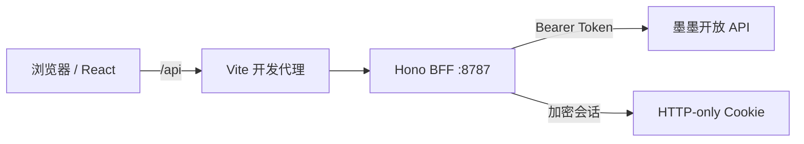

# MOMO Web

一个基于墨墨开放 API 的非官方 Web 客户端，为墨墨背单词与墨墨记忆卡提供统一的桌面端管理界面。

项目采用 React + TypeScript 构建前端，并通过 Hono BFF 代理墨墨开放 API。API Token 由服务端加密后保存在 HTTP-only Cookie 中，不会写入前端状态或浏览器本地存储。

> 当前版本为 `0.1.0`，更适合个人使用、功能体验和二次开发；尚未提供完整的生产部署方案。

## 功能

- 学习中心：今日进度、今日单词、翻卡复习、学习记录和批量添加单词
- 单词工具：按拼写查询单词，以及查看释义、助记和例句
- 内容管理：管理个人释义、助记、例句和云词本
- 墨墨记忆卡：浏览牌组、章节和卡片，编辑 Markji 内容并上传图片
- 使用体验：登录守卫、深浅主题、响应式导航、错误提示和 API 限流反馈

部分写入接口、学习公测接口以及墨墨记忆卡接口是否可用，取决于你的墨墨账号权限。

## 技术栈

| 类别 | 技术 |
| --- | --- |
| 前端 | React 18、TypeScript、Vite 6 |
| 路由与状态 | React Router 7、Zustand 5、TanStack Query 5 |
| 样式与动效 | Tailwind CSS 3、Motion、GSAP |
| 内容渲染 | KaTeX、项目内 Markji 渲染器 |
| BFF | Hono、`@hono/node-server` |
| 鉴权 | AES-256-GCM 加密、HTTP-only Cookie |

## 工作原理



浏览器只与同源的 `/api` 通信。BFF 从加密 Cookie 中读取 Token、注入上游请求，并统一处理认证、频控和错误响应。

## 快速开始

### 1. 克隆项目

```bash
git clone https://github.com/imnothaonan/momo-web.git
cd momo-web/momo-web
```

注意：仓库根目录主要存放设计与 API 文档，实际应用位于第二层 `momo-web/` 目录。

### 2. 安装依赖

```bash
npm ci
```

建议使用 Node.js 18 或更高版本，并优先使用项目中的 `package-lock.json` 安装依赖。

### 3. 启动开发环境

直接启动时，BFF 会生成临时会话密钥：

```bash
npm run dev
```

然后访问 [http://localhost:5173](http://localhost:5173)。该命令会同时启动：

- Vite 前端：`http://localhost:5173`
- Hono BFF：`http://localhost:8787`

未设置 `TOKEN_SECRET` 时，BFF 每次重启都会生成新的随机密钥，已有登录会话会随之失效。需要稳定会话时，请在启动前设置密钥。

PowerShell：

```powershell
$env:TOKEN_SECRET = "请替换为足够长的随机字符串"
npm run dev
```

Bash：

```bash
TOKEN_SECRET="请替换为足够长的随机字符串" npm run dev
```

### 4. 登录

在墨墨背单词 App 中依次进入：

`我的 → 更多设置 → 实验功能 → 开放 API`

获取 Token 后，在 MOMO Web 登录页中输入。Token 会由 BFF 验证并加密写入 HTTP-only Cookie，不会保存在 `localStorage` 中。

请勿提交 Token、Cookie 或包含真实账号数据的调试文件。

## 环境变量

| 变量 | 必需 | 默认值 | 说明 |
| --- | --- | --- | --- |
| `TOKEN_SECRET` | 生产环境必需 | 启动时随机生成 | 用于派生 AES-256-GCM 会话加密密钥 |
| `MOMO_API_BASE` | 否 | `https://open.maimemo.com/open` | 墨墨开放 API 上游地址 |
| `PORT` | 否 | `8787` | BFF 监听端口 |

当前服务端脚本直接读取进程环境变量，仓库未集成 `.env` 加载器。请使用 Shell、进程管理器或部署平台注入变量。

## 常用命令

以下命令均需在仓库的 `momo-web/` 应用目录中执行。

| 命令 | 作用 |
| --- | --- |
| `npm run dev` | 同时启动前端与 BFF 开发服务 |
| `npm run dev:web` | 仅启动 Vite 前端 |
| `npm run dev:server` | 仅启动 Hono BFF，并监听源码变化 |
| `npm run build` | 构建前端静态资源到 `dist/` |
| `npm run preview` | 本地预览前端构建产物 |
| `npx tsc --noEmit` | 执行 TypeScript 类型检查 |

## 页面路由

| 模块 | 路由 | 说明 |
| --- | --- | --- |
| 登录 | `/login` | Token 验证与会话创建 |
| 学习中心 | `/study` | 今日学习进度 |
| 今日单词 | `/study/today` | 今日任务列表与筛选 |
| 翻卡复习 | `/study/flashcard` | 卡片式复习 |
| 学习记录 | `/study/records` | 按日期范围查询学习记录 |
| 添加单词 | `/study/add` | 批量查询并加入学习计划 |
| 单词工具 | `/vocabulary` | 单词、释义、助记与例句查询 |
| 内容管理 | `/content` | 释义、助记和例句 CRUD |
| 云词本 | `/content/notepads` | 云词本列表与编辑 |
| 记忆卡 | `/markji` | 牌组、章节与卡片管理 |
| 设置 | `/settings` | 会话、主题、缓存与版本信息 |

除登录页外，其余页面均受前端路由守卫保护。

## 项目结构

```text
.
├─ design-preview/          # 单文件高保真交互原型
├─ momo-web/                # 实际应用目录
│  ├─ server/               # Hono BFF
│  ├─ src/
│  │  ├─ components/        # 布局、反馈与动效组件
│  │  ├─ lib/               # API Client 与 Markji 渲染器
│  │  ├─ pages/             # 页面组件
│  │  ├─ stores/            # 认证与设置状态
│  │  └─ types/             # CSS 与 OpenAPI 类型
│  ├─ api_bundle.yaml       # OpenAPI 描述文件
│  ├─ package.json
│  └─ vite.config.ts
├─ momo_web.md              # 架构设计文档
├─ 墨墨OpenAPI 规范.md       # 整理后的 OpenAPI 规范
└─ 墨墨开放api.md            # API 资料与实测补充
```

## 已知限制

- 学习数据属于墨墨公测能力，需要在 App 中开启自动同步，并在当天打开 App 完成初始化。
- 内容写入接口可能要求额外权限；无权限时上游会返回 `403`。
- 墨墨记忆卡相关接口需要开通 Markji Plus。
- BFF 的短周期频控使用单进程内存计数，不适合直接用于多实例部署。
- `npm run build` 只生成前端静态资源；仓库目前没有生产用的 BFF 启动脚本，也不会自动托管 `dist/`。
- 上游 API 可能调整字段或权限，项目中的手写业务类型包含实测修正，应与 `api_bundle.yaml` 一并维护。

## 生产部署前检查

当前代码可用于本地开发，但上线前至少需要补齐以下工作：

1. 使用高强度、固定的 `TOKEN_SECRET`，并通过部署平台的 Secret 管理能力注入。
2. 使用 HTTPS，并为会话 Cookie 启用 `Secure` 属性。
3. 为 BFF 增加正式构建和启动脚本，配置静态资源托管或反向代理。
4. 多实例部署时，将频控改为 Redis 等共享存储，并明确用户隔离策略。
5. 配置日志脱敏、错误监控、CSRF 防护策略和可信来源限制。

## 相关文档

- [架构设计](./momo_web.md)
- [墨墨 OpenAPI 规范](./墨墨OpenAPI%20规范.md)
- [墨墨开放 API 资料与实测补充](./墨墨开放api.md)
- [交互原型](./design-preview/index.html)

## 声明

本项目是基于墨墨开放 API 开发的非官方客户端，与墨墨官方无隶属或背书关系。请遵守墨墨开放 API 的使用规则，不要将个人 Token 分享给他人。

仓库当前未包含开源许可证。在添加许可证之前，默认不授予复制、修改、分发或再许可代码的权利；如计划开放协作，建议由仓库所有者补充明确的 `LICENSE` 文件。
